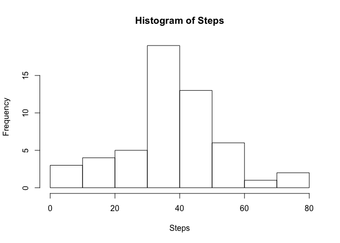
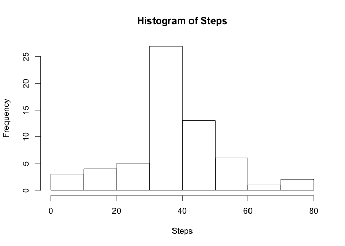
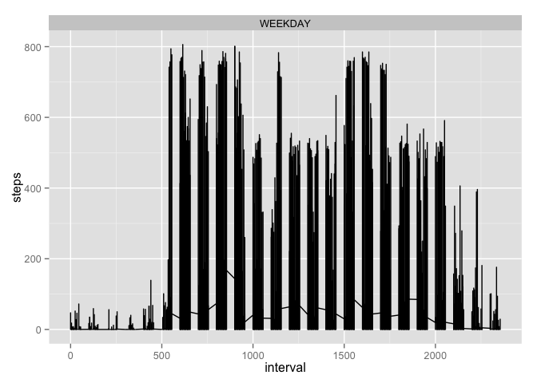

# Reproducible Research: Peer Assessment 1


## Loading and preprocessing the data

Once the data has been downloaded into your working directory, you will want to load the data and assign it to variable "activity".


```r
activity<-read.csv("activity.csv")
```

The date column in activity is not formatted as a date class so you will want to covert it to date. 


```r
activity$date<-as.Date(activity$date)
```

Finally, I will want to create a data set without any NA's that I can work with. 


```r
activity.sub<-na.omit(activity)
```

## What is mean total number of steps taken per day?

In order to determine the number of steps taken per day, I used the aggregate function in order to group the number of steps by date. 


```r
Steps<-aggregate(activity.sub$steps, list(Date=activity.sub$date),mean)
colnames(Steps)<-c("Date", "Total Steps")
```


```
##          Date Total Steps
## 1  2012-10-02   0.4375000
## 2  2012-10-03  39.4166667
## 3  2012-10-04  42.0694444
## 4  2012-10-05  46.1597222
## 5  2012-10-06  53.5416667
## 6  2012-10-07  38.2465278
## 7  2012-10-09  44.4826389
## 8  2012-10-10  34.3750000
## 9  2012-10-11  35.7777778
## 10 2012-10-12  60.3541667
## 11 2012-10-13  43.1458333
## 12 2012-10-14  52.4236111
## 13 2012-10-15  35.2048611
## 14 2012-10-16  52.3750000
## 15 2012-10-17  46.7083333
## 16 2012-10-18  34.9166667
## 17 2012-10-19  41.0729167
## 18 2012-10-20  36.0937500
## 19 2012-10-21  30.6284722
## 20 2012-10-22  46.7361111
## 21 2012-10-23  30.9652778
## 22 2012-10-24  29.0104167
## 23 2012-10-25   8.6527778
## 24 2012-10-26  23.5347222
## 25 2012-10-27  35.1354167
## 26 2012-10-28  39.7847222
## 27 2012-10-29  17.4236111
## 28 2012-10-30  34.0937500
## 29 2012-10-31  53.5208333
## 30 2012-11-02  36.8055556
## 31 2012-11-03  36.7048611
## 32 2012-11-05  36.2465278
## 33 2012-11-06  28.9375000
## 34 2012-11-07  44.7326389
## 35 2012-11-08  11.1770833
## 36 2012-11-11  43.7777778
## 37 2012-11-12  37.3784722
## 38 2012-11-13  25.4722222
## 39 2012-11-15   0.1423611
## 40 2012-11-16  18.8923611
## 41 2012-11-17  49.7881944
## 42 2012-11-18  52.4652778
## 43 2012-11-19  30.6979167
## 44 2012-11-20  15.5277778
## 45 2012-11-21  44.3993056
## 46 2012-11-22  70.9270833
## 47 2012-11-23  73.5902778
## 48 2012-11-24  50.2708333
## 49 2012-11-25  41.0902778
## 50 2012-11-26  38.7569444
## 51 2012-11-27  47.3819444
## 52 2012-11-28  35.3576389
## 53 2012-11-29  24.4687500
```
We can see the distribution of number of steps per day by creating a histogram:


```r
hist(Steps[,2], main="Histogram of Steps", xlab="Steps", ylab="Frequency")
```

 

The mean number of steps taken is:

```r
meanSteps<-mean(Steps[,2])
print(meanSteps)
```

```
## [1] 37.3826
```

The median number of steps taken is:

```r
medianSteps<-median(Steps[,2])
print(medianSteps)
```

```
## [1] 37.37847
```

## What is the average daily activity pattern?

In order to see the average daily activity pattern, we will aggregate steps by time and plot a line chart.


```r
time<-aggregate(activity.sub$steps, list(activity.sub$interval), mean)
colnames(time)<-c("interval", "mean_steps")
plot(time, type='l', xaxp=c(0, 2500, 10), xlab="5-Minute Interval", ylab="Average Steps")
```

 
From the plot, it looks like the most steps are taking a little before the 9th hour of the day (9:00 am)


## Imputing missing values

We will want to replace all the NA values in our data set for completion. Since I have a complete data set as well as a data set without the NA vaues, I can subtract the row count of the two to find how many NA values there are. 


```r
naCount<-nrow(activity)-nrow(activity.sub)
print(naCount)
```

```
## [1] 2304
```

The most logical value to replace the NA steps with is the man value of steps at that interval. To do that, I will run the following steps: <br/>
1. Create a data frame of mean steps per interval. This has already been completed and the results are in data frame "time" <br/>

2. Merge this using dplyr with the original "Activity" data set to append the mean Steps value at a row's interval to each row. <br/>

3. For any rows with AN for steps, replace it with the corresponding mean value for that interval. <br/>

4. Delete the mean steps column to have an "Activity" data frame with all the NA's replaced with mean steps for that interval.<br/>


```r
library(dplyr) #Need to use the dyplyr package for an inner join
```

```
## 
## Attaching package: 'dplyr'
## 
## The following object is masked from 'package:stats':
## 
##     filter
## 
## The following objects are masked from 'package:base':
## 
##     intersect, setdiff, setequal, union
```

```r
activity_complete<-inner_join(activity, time) #Step 2
```

```
## Joining by: "interval"
```

```r
activity_complete$steps[is.na(activity_complete$steps)]<-activity_complete$mean_steps[(is.na(activity_complete$steps))] #Step 3
activity_complete$mean_steps<-NULL
```

As we can see below from the first ten rows of activity_complete, the NA's for steps in each row are now replaced by the mean for that interval.


```r
head(activity_complete, 10)
```

```
##        steps       date interval
## 1  1.7169811 2012-10-01        0
## 2  0.3396226 2012-10-01        5
## 3  0.1320755 2012-10-01       10
## 4  0.1509434 2012-10-01       15
## 5  0.0754717 2012-10-01       20
## 6  2.0943396 2012-10-01       25
## 7  0.5283019 2012-10-01       30
## 8  0.8679245 2012-10-01       35
## 9  0.0000000 2012-10-01       40
## 10 1.4716981 2012-10-01       45
```

We can use these new values to create a new histogram of steps taken per day and calculate a new mean and median. 


```r
Steps_Complete<-aggregate(activity_complete$steps, list(Date=activity_complete$date),mean)
colnames(Steps_Complete)<-c("Date", "Total_Steps")
hist(Steps_Complete$Total_Steps, main="Histogram of Steps", xlab="Steps", ylab="Frequency")
```

 

```r
meanSteps<-mean(Steps_Complete$Total_Steps)
medianSteps<-median(Steps_Complete$Total_Steps)
```

The new mean is: 

```r
print(meanSteps)
```

```
## [1] 37.3826
```
and the new median is:

```r
print(medianSteps)
```

```
## [1] 37.3826
```


## Are there differences in activity patterns between weekdays and weekends?

To determine which days are weekdays and which are weekends, I will create a function to determine if a specific date is a weekday or weekend. 


```r
weekend<-function(x){
  day<-weekdays(x)
  if (day=='Saturday' || day=='Sunday'){
    weekend<-"WEEKEND"
  }
  else
    weekend<-"WEEKDAY"
  return(weekend)
}
```

Using this function, I'll add a column denoting whether or not that measurement is taken on a weekend. 


```r
activity_weekend<-mutate(activity_complete, weekend=weekend(activity_complete$date))
activity_weekend$weekend[10000]
```

```
## [1] "WEEKDAY"
```

```r
library(ggplot2)
ggplot(activity_weekend, aes(interval, steps))+geom_line()+facet_wrap(~weekend, nrow=2)
```

 


